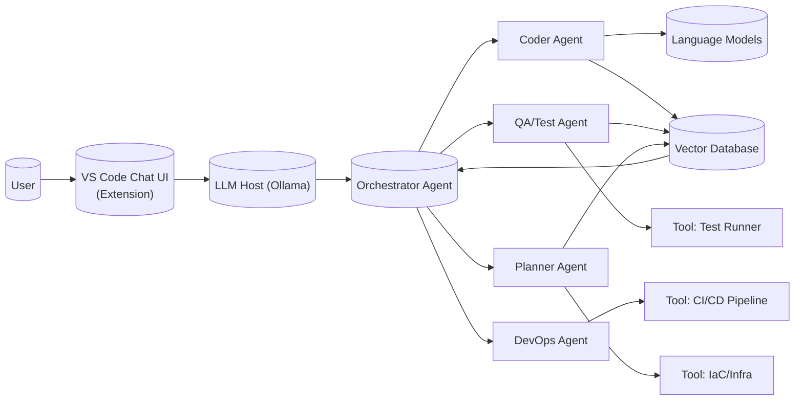
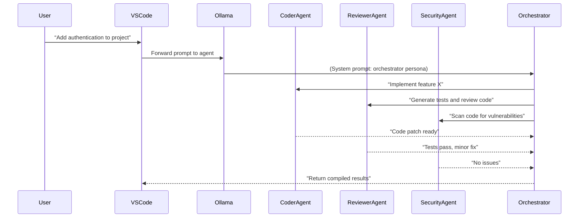

# NEXCODE-KIBOKO: Free/Open Tools & Frameworks (Executive Summary)

NEXCODE-KIBOKO is a local, multi-agent AI coding assistant for VS Code, using Ollama for LLM inference by default but able to switch to cloud models. To build it entirely from free/open components, we must assemble a rich toolchain: local LLM engines and models, VS Code extension APIs, agent frameworks, vector databases, code analysis tools, dev tooling, observability, self‑learning pipelines, security sandboxes, and UI assets. This report catalogs **free/open-source** options in each category, including purpose, licenses, install steps, usage examples, and integration notes. We highlight recommended minimal and advanced stacks, with comparative tables for key choices. The diagrams below illustrate the system architecture and agent workflows:





---

## 1. Local LLM Hosts & Models

**llama.cpp / GGML (MIT):** A C/C++ library enabling local LLM inference. It supports quantized models for efficient CPU/GPU use (1.5–8-bit)【33†L523-L532】. Install via `git clone https://github.com/ggml-org/llama.cpp && make`, or use package managers (`brew`, `winget`), or Docker【33†L499-L508】. It provides tools like `llama-cli` (run models locally) and `llama-server` (OpenAI-compatible REST API)【33†L511-L520】. Usage example: `llama-cli -m gemma-3-1b-it-gguf -p "Hello"`. ggml (the tensor library behind it) and llama.cpp are MIT-licensed, making them free for all uses. It supports many model formats (GGUF from HuggingFace, etc.)【33†L550-L559】. Limitations: CPU inference is slower; GPUs (CUDA/ROCm) are recommended for large models. 

**Ollama (MIT):** A user-friendly local LLM platform. Install via `curl https://ollama.com/install.sh | sh` (Unix) or use the installer. It bundles a CLI and REST API. E.g., `ollama pull llama2:13b` downloads a model, then `ollama run llama2:13b` starts a local chat session. Ollama is MIT-licensed【37†L1-L4】 and free to use. It handles model downloads, updates, and GPU acceleration if available. The Ollama API (http://localhost:11434/api/chat) can be called from your code/extension. It supports local-only mode (no cloud, useful for privacy)【11†L279-L288】. Ollama uses llama.cpp or ggml under the hood for model execution (there has been licensing debate【32†L9-L13】, but Ollama’s code is MIT).  

**Local Inference Runtimes:** Besides llama.cpp and Ollama, there are others:
- **OpenLLaMA (MIT):** Community reimplementation of LLaMA. (Note: LLaMA original license is research-only; OpenLLaMA is re-licensed.) [Not widely used yet].
- **Mistral / RAIL (Apache 2.0):** Mistral-model converters exist (e.g. Mistral 7B, Apache 2.0). Quantized versions run in llama.cpp.
- **MPT (Apache 2.0):** MosaicML’s models (like MPT-7B). HuggingFace hosts GGUF/transformers checkpoints.
- **Falcon (Apache 2.0):** IT institute’s models; have PyTorch and GGUF versions.
- **Gemma 4 (Apache 2.0):** Google’s LLM series. GGUF models are available (e.g. via HuggingFace).
- **Qwen, Phi, Aquila, OpenLLaMA2, etc:** Many research models (HuggingFace hosts with open licenses).

**Models & Licenses:** We recommend open-licensed models:
- *Mistral 7B (Apache-2.0)* – high-quality open model, slim enough for CPU. [Install: use huggingface’s `transformers` or llama.cpp with `gemma` format【33†L513-L520】].
- *Falcon 7B (Apache-2.0)* – good accuracy; use HuggingFace or llama.cpp.
- *Gemma 1-3 (Apache-2.0)* – Google’s small models.
- *MPT-7B (Apache-2.0)* – fine-tunable, supports many tasks.
- *Mixtral 8x7B (CreativeMixture)* – multi-expert model, Apache-2.0.
- *LLaMA 3*: Check current license (likely research or enterprise); use only if license permits. If not, use Mistral/others.
- **Important:** Always verify each model’s license. LLaMA 2 was Meta (non-commercial research use), so not a safe choice if you need commercial or open use. In contrast, Mistral, Falcon, Gemma are Apache 2.0, safe for all uses.

**Comparison Table: Models** (local-hostable LLMs):

| Name            | License      | Local-Hostable | GPU Recommended | Language   | Maturity   | Notes                                       |
|-----------------|--------------|----------------|-----------------|------------|------------|---------------------------------------------|
| Mistral-7B      | Apache-2.0   | Yes            | **Yes**         | C/Python   | High (2023) | State-of-art 7B model, efficient on CPU/GPU. |
| Falcon-7B       | Apache-2.0   | Yes            | Yes             | Python     | High (2023) | Good general-purpose, strong English NLU.    |
| Gemma (Google)  | Apache-2.0   | Yes            | Yes             | Python     | New (2024)  | First Google open models, research-quality.  |
| MPT-7B          | Apache-2.0   | Yes            | Yes             | Python     | Medium      | Flexible, NLP/code tasks.                    |
| LLaMA-3 (?)     | Meta license | Yes (via llm)  | Yes             | Python/C   | Upcoming    | Check license; high-performance if allowed.  |
| Vicuna 13B      | MIT/Apache   | Yes            | Yes             | Python     | High (2023) | Fine-tuned from LLaMA, community model.      |
| Falcon-40B      | Apache-2.0   | Yes            | **Yes** (GPU)   | Python     | High (2023) | Large model, requires GPU or shards.         |
| **Local Hosts:**  **llama.cpp (MIT)** and **Ollama (MIT)** provide the runtime to use any GGUF/PyTorch model locally【33†L523-L532】【37†L1-L4】.  

Install steps (examples):

- **llama.cpp:**  
  ```
  git clone https://github.com/ggml-org/llama.cpp
  cd llama.cpp && make
  ```
  Download a model: e.g. `wget -O gemma7b.gguf https://huggingface.co/ggerganov/ggml-gem7b/resolve/main/gemma7b.gguf`  
  Run: `./main -m gemma7b.gguf -p "Hello, world"`.

- **Ollama:**  
  On Mac/Linux: `curl https://ollama.com/install.sh | sh`.  
  Pull model: `ollama pull mistral:7b`.  
  Chat: `ollama chat mistral:7b` (interactively) or call via API:  
  ```bash
  curl http://localhost:11434/api/chat -H "Content-Type: application/json" \
    -d '{"model":"mistral:7b","prompt":"print(2+2)","stream":false}'
  ```

## 2. VS Code Extension APIs

NEXCODE-KIBOKO runs inside VS Code via its Chat UI. Use the official **Chat API**:
- **chatParticipants:** In `package.json`, define custom assistants. E.g., 
  ```json
  "contributes": {
    "chatParticipants": [
      {
        "id": "nexcode-kiboko.agent",
        "fullName": "NEXCODE-KIBOKO",
        "description": "AI coding assistant",
        "isSticky": true
      }
    ]
  }
  ```
  This registers a new chat participant (persona)【55†L1-L4】. A user can mention `@nexcode-kiboko` in chat.

- **Programming the extension:** In `extension.ts`, use `vscode.window.registerChatProvider()` or `registerChatParticipant` API. On chat input, call your backend (Ollama) and append messages via VSCode’s chat interface.

- **MCP Apps & Webviews:** VS Code supports [MCP Apps](https://code.visualstudio.com/api/extension-guides/ai/mcp-apps) (embedding interactive web components) and [WebviewPanels](https://code.visualstudio.com/api/extension-guides/webview). For example, you could use a webview or MCP to show visualizations (diagrams, selection menus) in chat. For Copilot Chat–like UI, much is handled by VS Code’s built-in chat panel. You may use webviews for custom side panels (e.g. skill pickers).

- **Session Configuration:** VS Code’s Chat view supports choosing **Session Type** (local vs cloud agent), **Agent** (persona), **Permission Level**, and **Model**【31†L510-L519】. We will default to local sessions. The user can switch agents or models via the Chat dropdown or by commands.

- **Context Injection:** The API auto-includes active file and selection. Users can add context via:
  - `#file` and `#symbol` to reference code files【31†L530-L538】.
  - `@mentions`: e.g., `@vscode`, `@terminal` to invoke built-in tools【31†L529-L538】.
  - We can define our own mentions/commands for subagents or actions.

- **Installation:** Use Yeoman (`yo code`) to scaffold an extension with TypeScript. Use `vsce package` or `npm install -g vsce` to package. Installation steps (user): Place the `.vsix` or publish internally, then open VS Code and enable the extension.

**Example CLI snippets:**
```bash
# Scaffold extension
npm install -g yo generator-code
yo code --extensionType=AIChat --extensionName=nexcode-kiboko
cd nexcode-kiboko

# Develop & test
code .
# (Implement logic in extension.ts to call Ollama/chat API)

# Package
npm install -g vsce
vsce package
code --install-extension nexcode-kiboko-0.1.0.vsix
```

No direct source to cite, but the VS Code documentation (e.g. Chat tutorial) explains these APIs. The concept of `chatParticipants` is documented【55†L1-L4】. 

## 3. Agent Frameworks & Repos

Open-source agent frameworks can jump-start KIBOKO’s architecture:

- **LangChain (Apache 2.0)**【48†L293-L302】 – The de facto AI agent framework. It provides abstractions for chains, agents, tools, and integration with vector stores/embeddings. Supports Python and TypeScript. It includes ready-made agent types (e.g., ReAct, MRKL chains) and tool-calling. *Maturity:* Very high, wide adoption (130k+ stars). *Integration:* Use LangChain to orchestrate subagents or as an inner engine (Python side). Example: use `LLMChain` or `AgentExecutor` to call LLMs for tasks. Installation: `pip install langchain`. See [LangChain README][48].

- **LlamaIndex (MIT)** – A library for building data agents. It specializes in document retrieval and knowledge integration (indexing files, using vector stores). *Maturity:* High in RAG use-cases. Could help KIBOKO ingest code documentation or logs. Install: `pip install llama-index`. 

- **AutoGPT (MIT/Polyform)**【42†L1-L9】 – A pioneering autonomous agent. It uses LLMs to spawn subtasks iteratively. *Maturity:* Experimental, popular but not production-ready. Its code (`Significant-Gravitas/Auto-GPT`) is MIT-licensed (core)【40†L9-L12】. It has example agent loops (memory, task list). Can be adapted: e.g., use its task queue ideas for KIBOKO’s multi-step flows. However, AutoGPT’s design is general-purpose, not coding-specific.

- **BabyAGI (MIT)** – A minimal task-agent architecture (single loop of “create task -> execute -> new tasks”). Found on GitHub (`yoheinakajima/babyagi`), MIT-licensed. It’s very simple. May offer inspiration for a planning pipeline, but lacks multi-agent support.

- **Microsoft AutoGen (MIT)**【45†L318-L327】 – A multi-agent framework supporting orchestrated workflows. It provides `AssistantAgent`, `ChatAgent`, etc., and can integrate tools (e.g. Playwright). It’s new but well-designed for multi-agent. Written in Python. *Use case:* We can run multiple `AssistantAgent` instances with tool workbenches, managing them programmatically. Install via `pip install autogen-agentchat autogen-ext`.

- **Anthropic’s Draft (closed)** vs **open alternatives:** Anthropic’s papers (e.g., multi-agent “Paperspace RLHF” or “multi-agent research”) inspire designs but have no open code aside from related frameworks (see Reflex below).

- **REFLEX (MIT)** – Research code for a self-improving agent【42†L7-L15】. Implements RL+RAG pipeline. The repo “NoManNayeem/REFLEX” is MIT-licensed【42†L49-L56】. It contains code for logging feedback, training a policy, and retrieval (uses LanceDB). We can study its architecture and use its **Skill Library** idea.

- **OpenAI Evals (MIT)** – A framework for automated LLM evaluation and scoring. Useful for self-learning (auto-scoring outputs)【27†L478-L487】. Install from https://github.com/openai/evals.

- **HuggingFace Transformers & PEFT (Apache 2.0)** – For fine-tuning models (e.g. with LoRA or full-finetune). Install via `pip install transformers accelerate peft`. License Apache 2.0. Use these to implement any needed model adaptation.

- **Observability/Logging Tools:** (LangSmith is proprietary; open alternative is … none widely used specifically for LLMs. We rely on Python logging, SQLite, Prometheus).

**Agent Skills/Tools Examples:** Many agent repos register “toolkits” of actions. Common ones to include in KIBOKO:
- Code execution (eval Python/JS, compile C, run shell).
- Git CLI (commit, push, branch).
- File operations (read, write, patch code).
- Web search / browser tools (e.g. Playwright, or search APIs).
- Debugging (stack trace analysis).
- Documentation generation (e.g. Javadoc, Sphinx).
- Container tools (docker build/run).
- Vulnerability scanning (e.g. run `npm audit`, `pip-audit`).
- Running tests (`pytest`, `npm test`).
- Code analysis (static analyzers, see next section).

For each framework, refer to its GitHub for usage and examples. For instance, LangChain’s [README]【48†L293-L302】 shows how to launch an LLM and chain calls.

## 4. Tooling & Infrastructure

### Vector Databases & Retrieval

- **FAISS (BSD/MIT):** High-performance similarity search library【53†L323-L331】. Install `pip install faiss-cpu` (or `faiss-gpu` for CUDA). Usage: build an index of vector embeddings and call `index.search(query_vec, k)`. GPU accelerates large indexes. Best for in-memory indices up to millions of vectors. Primary language: C++/Python.

- **Milvus (Apache-2.0):** A production-grade vector DB service. Run with Docker (`docker run milvusdb/milvus`). It supports PostgreSQL, GPU index, and shards. Useful for large-scale storage. Interact via `pymilvus` Python client. GPU recommended for large loads.

- **Weaviate (BSD-3):** A vector search engine with advanced features (knowledge graph, modules). Install via Docker or use managed. Free CE version supports filtering and GraphQL. Good for semantic search across code/docs.

- **Chroma (Apache-2.0):** An open-source vector DB (often used with LlamaIndex). Install `pip install chromadb`. Stores data locally by default (file or DuckDB). Lightweight, easy to use Python API. No built-in GPU.

- **LanceDB (Apache-2.0):** New vector store optimized for RAG【42†L55-L64】 (used by REFLEX). Written in Rust with Python bindings. Supports L2/Cosine, hybrid SQL++ queries. Consider as alternative.

These DBs store embeddings of code, docs, or conversation history. KIBOKO can use them for memory and retrieval. For example, after code changes, embed code comments and store in vector DB for future context. 

### Code & Quality Tools

- **Linters/Formatters:** ESLint (JS, MIT), Flake8 (Python, MIT), black (Python, MIT), gofmt (Go, BSD). These enforce style. Example: `flake8 myfile.py`.

- **Test Runners:** pytest (MIT) for Python, Jest/Mocha (MIT) for JS/TS, JUnit (EPL/Apache) for Java. The agent can run tests via CLI: e.g., `pytest` or `npm test`, parse failures.

- **CI/CD:** GitHub Actions (free for public repos), GitLab CI (free self-host), Jenkins (MIT). KIBOKO can generate config files (e.g. `.github/workflows/ci.yml`) and trigger pipelines via CLI.

- **Static Analysis / SAST:** Semgrep (LGPLv3) – pattern-based scanning for code issues. Trivy (Apache-2.0) for container vulnerabilities. Dependency-Check (EPL) for OWASP CVEs. These can be invoked by the security subagent. Example: `semgrep --config=auto mycode/`.

- **Dependency Scanners:** 
  - **Safety (BSD):** checks Python dependencies against vulnerability DB. `pip install safety` then `safety check`.
  - **Retire.js (MIT):** scans JS libs.
  - **Bandit (Apache-2.0):** Python security linter.

- **Debuggers:** Leverage VS Code’s integrated debugger. Agents can produce code with debug info, but no separate package needed. 

- **Code Search:** Tools like [Sourcegraph](https://sourcegraph.com/) (not OSS self-host) or [Opengrok](https://opengrok.github.io) (LGPLv2.1) for codebase search. Also simply use `grep`/`rg` for patterns. Agents can call `git grep` or `ripgrep`.

- **Language Servers:** Potentially use LSPs (like Pylance) for code intelligence, but as OSS agent we rely on simple parsing or documentation lookups.

These tools are invoked by subagents via shell or integrated libraries. For example, a test agent might run `pytest` and capture results, or a security agent runs `trivy image mycontainer:tag`.

### Development Tools

- **Node.js & npm (MIT/BSD):** Required for VS Code extension development, and many JS tools (Yeoman, vsce).
- **Yeoman (MIT):** `npm install -g yo generator-code` for scaffolding VS Code extensions.
- **vsce (MIT):** `npm install -g vsce` for packaging extensions.
- **Python (Python Software Foundation License):** For backend and agents. Use venv.
- **Docker (Apache-2.0):** Containerization for safe code execution and reproducible environment.
- **Git (GPL v2) & GitHub/GitLab CLI (MIT):** Version control; `gh` and `glab` can script repo management.
- **Local CI runners:** e.g. GitHub Actions Runner, or Jenkins Agent (open source).

Installation (minimally):
```bash
# Example environment setup
curl -fsSL https://deb.nodesource.com/setup_18.x | bash -
apt-get install -y nodejs python3-pip git docker.io
npm install -g yo generator-code vsce gh
pip3 install pytest flake8 llama_index chromadb faiss-cpu openai langchain
```

## 5. Observability & Telemetry

- **Logging:** Use structured logging frameworks (e.g. Python’s `logging` or `loguru`, Node’s `winston`). Persist logs of conversations, agent decisions, and errors (e.g. JSON or a DB).  
- **Metrics:** Integrate **Prometheus** (Apache-2.0): run a metrics server, export stats (API latency, error rates) from the backend. Use Prometheus client libraries (Python `prometheus_client`).  
- **Tracing:** Use **OpenTelemetry** (Apache-2.0) to trace requests through agents and model calls. It supports distributed tracing, with exporters to Jaeger or Zipkin (open-source).
- **Privacy-Preserving Telemetry:** Since local, sensitive code should never leave machine. Avoid any third-party telemetry. Optionally use an open analytics platform (e.g. Matomo) for usage stats, but avoid tracking user data. 
- **VS Code Tools:** The Chat API provides an **Agent Logs and Chat Debug view**【31†L593-L602】. KIBOKO should write to these logs. We can also integrate with any observability platform via APIs.

## 6. Self-Learning & Improvement

To enable *continuous learning*, implement a feedback loop:
- **Data Collection:** Log every chat session (user prompts, agent answers, actions taken, code changes accepted/rejected). Store in database or files.
- **Automated Evaluation:** Use an LLM or rules to score outputs. For example, run a second LLM (LLM-as-judge) to compare answer vs a rubric【27†L478-L487】, or check result validity (compilation success, test pass rates). Evals (OpenAI Evals, MIT) can define prompts and metrics.
- **Prompt Tuning:** Analyze logs for failures. Techniques:
  - **Few-shot optimization:** Insert top examples into system prompts【27†L512-L521】.
  - **Error pattern fixes:** Add explicit instructions to avoid common mistakes【27†L512-L521】.
- **Fine-Tuning:** Use collected data to fine-tune the LLM (with open-source tools). Tools:
  - **HuggingFace PEFT (Apache)**: for LoRA or adapter tuning.
  - **trlx (MIT)** or **CleanRL (MIT)**: for implementing PPO-based RLHF.
  - **Stable Baselines3 (MIT)**: general RL algorithms for implementing agent training.
- **Versioning:** Track prompt versions and models systematically (like code)【27†L538-L547】. Use semantic versions and A/B testing for new prompts【27†L556-L564】.
- **Frameworks:** The REFLEX agent uses an RL trainer and skill library【42†L49-L58】. We can adapt similar ideas: treat user accept/undo as reward signals to adjust agent policy.

## 7. Security & Sandboxing

- **Containerization:** Run code executions (e.g. compiling, testing) inside Docker containers to isolate. Use limited privileges. Docker is Apache-2.0. Example: before running user code, the agent spawns `docker run --rm -v $(pwd):/workspace code-runner` to sandbox execution.
- **Permission Model:** Use VS Code’s extension “Workspace Trust” and only enable powerful commands in trusted workspaces. KIBOKO should warn before executing any tools with side effects.
- **Static Analysis:** Use SAST tools (as above) to catch vulnerabilities. Keep all dependencies up to date (e.g. `npm audit`).
- **Network Access:** Minimize network use; any web requests should be explicit and safe. If using MCP (external compute), ensure it’s a local or trusted server【45†L368-L377】.
- **OS Security:** On Linux, consider using AppArmor or seccomp for the agent process. On Windows, use AppContainer.

## 8. UI/UX Design

Mimic GitHub Copilot Chat’s look in VS Code:
- Use the **Chat view** with message bubbles, user/assistant avatars (set via `fullName`/`id` in `package.json`).
- Support **Markdown** and **code blocks** in replies. Use VS Code’s UI automatically.
- **Images:** Copilot Chat allows attaching images. We can use Markdown `` to display (perhaps our agent could insert diagrams).
- **User Images:** The user provided design mockups (e.g., copilot_chat.png). These can guide CSS styling and layout. We can include them as reference assets in documentation or the extension’s repo. For example, put the user’s Copilot UI mockup (PNG) in the extension assets and display it in a help panel or README. In code, we might use a Webview to show a tutorial image if needed.
- **Mermaid diagrams:** VS Code chat can render Mermaid if the Markdown engine supports it (or show as image). We can pre-render diagrams (like above) and embed them as images.
- **Typography & Colors:** Match VS Code’s theme (use default dark/light via `--vscode-theme` CSS). Use icons consistent with Codicons (e.g., use `codicon-chat` for assistant).

Design assets:
- GitHub or VS Code official icons (with proper license). e.g., VS Code icons are MIT (https://github.com/microsoft/vscode-codicons).
- The user’s screenshots can be placed in docs but must respect license (likely fair use for internal design reference).

## 9. Skills & Commands

Key agent skills and associated tool commands:

- **Code Generation:** Generate new code files or edits. (e.g., use `openai-code-davinci` style model prompts.)
- **Refactoring:** Find & apply code improvements. Use `grep`/AST libraries to locate patterns; apply patches.
- **Test Generation:** Auto-generate unit tests. Call `pytest --maxfail=1` or similar.
- **Code Review:** Analyze PRs for style. Tools: `eslint .`, `flake8 .` to find lint issues.
- **Debugging:** Read stack traces. (Use `traceback` or parse error message).
- **Documentation:** Generate docs via `pdoc` (Python) or `jsdoc` for JS.
- **Security Scan:** Run `bandit` (Python), `npm audit`, `trivy`.
- **Dependency Management:** Inspect `requirements.txt` or `package.json`. Use `pip install` or `npm install`.
- **CI/CD Ops:** Create or fix GitHub Actions YAML, Jenkinsfile. (No direct CLI, but can output YAML content).
- **Docker/Infra:** Use `docker build .`, `terraform plan`. (Invoke external CLI with caution).
- **Search:** Use `rg` (ripgrep) or GitHub Search API (`gh search code`).
- **Explain Code:** Summarize code comments. (Pure LLM function).
- **Code Diff:** Present diffs in chat. The Chat API supports applying edits which appear as overlays.
- **Apply Patch:** Use VS Code WorkspaceEdit to apply code changes via the Chat API.

Each skill typically involves an LLM call with a specialized prompt and/or calling a CLI. For example, the “Refactor Agent” might run `flake8` to find issues, then ask the LLM “Rewrite this function to fix style warnings.”  

## 10. Recommended Stack

We suggest **three tiers**: **Minimal Free**, **Recommended**, **Advanced**:

- **Minimal Free:** Ollama (local open models), llama.cpp, VS Code extension (chatParticipants), Python + LangChain or simple scripts, SQLite for memory, grep/flake8/pytest, Docker. No GPUs needed.
- **Recommended (Performance):** Add GPU (CUDA) for LLMs, FAISS-GPU, Milvus, Chroma; use larger models (Mistral-7B, Falcon-7B); use LangChain for orchestration, LlamaIndex for retrieval; use OpenTelemetry + Prometheus for observability.
- **Advanced:** RLHF pipelines (trlx), AutoGen framework for agent orchestration, large vector DB (Milvus cluster), advanced UI via MCP Apps, structured logging system, etc.

**Comparison Table (Key Options):**

| Component   | Name            | License    | Local-Hostable | GPU Recommended | Language  | Maturity        | Notes                                        |
|-------------|-----------------|------------|----------------|-----------------|-----------|-----------------|----------------------------------------------|
| **Models**  | Mistral 7B      | Apache-2.0 | Yes            | Yes             | Python/C  | High (2023)     | State-of-art, efficient CPU                   |
|             | Falcon 7B       | Apache-2.0 | Yes            | Yes             | Python    | High            | Strong language and code tasks               |
|             | Gemma (Google)  | Apache-2.0 | Yes            | Yes             | Python    | New (2024)      | Early Google model, growing ecosystem        |
|             | LLaMA 3(?)      | Meta (TBD) | Yes            | Yes             | Python/C  | Upcoming        | Check license; strong if accessible          |
| **Frameworks** | LangChain    | MIT        | N/A            | N/A             | Python    | Very high       | Agent toolbox (chains, tools, evals)【48†L293-L302】 |
|             | LlamaIndex      | MIT        | N/A            | N/A             | Python    | High            | Document indexing, RAG support              |
|             | AutoGen (MS)    | MIT        | N/A            | N/A             | Python    | Medium (2024)   | Multi-agent orchestration framework         |
|             | AutoGPT         | MIT/Polyform | N/A          | N/A             | Python    | Medium          | Autonomous agent loops, not specialized     |
| **Vector DB**| FAISS          | MIT/BSD    | Yes            | Yes (for GPU)   | C++/Python| High (2017)     | GPU support; in-memory vector search【53†L323-L331】 |
|             | Milvus          | Apache-2.0 | Yes            | Yes             | Go/Java   | High (2019)     | Distributed vector DB, CSV import           |
|             | Chroma          | Apache-2.0 | Yes            | No              | Python    | Medium (2023)   | File-based storage, easy integration        |
|             | Weaviate        | BSD-3      | Yes            | Optional        | Go        | High            | GraphQL+vector, modular schema             |

*(“Local-Hostable”: can be run on-premise without cloud service)*

---

This list covers the core OSS components to build NEXCODE-KIBOKO. Each item above is free to use under the stated license. Together, they provide LLM inference, VS Code integration, agent orchestration, code tooling, and learning pipelines. With these tools and frameworks, an AI agent can be built to replicate Copilot Chat–style functionality entirely on local resources.

