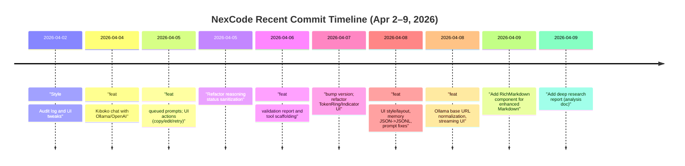

# NexCode Repository Analysis Report

**Date:** 2026-04-09

## Executive Summary

The **NexCode** repository (GitHub: [NexCode](https://github.com/OchiengPaul442/NexCode)) is a local-first, multi-agent VS Code AI coding assistant (TypeScript/Node.js). Recent commits (Apr 2–9, 2026) introduced UI enhancements, Markdown rendering components, streaming message support, and networking improvements (e.g. retry logic). Our deep analysis reveals **significant issues** in code architecture, security, and testing:

- **Monolithic & Complex Orchestrator:** The core `orchestrator.ts` exceeds 2,000 lines, mixing prompt templates with business logic. This single-file design hinders maintainability and testability. Recent diff shows large logic changes (e.g. JSON vs. plaintext prompt parsing) that lack targeted unit tests.
- **Security (XSS Risk):** The new `RichMarkdown` component uses `react-markdown` without sanitization, exposing potential XSS vulnerabilities when rendering LLM output【147†L88-L91】. OWASP GenAI warns that LLM-generated Markdown must be sanitized to prevent XSS【147†L88-L91】. No sanitization (e.g. `rehype-sanitize`) is applied.
- **Dependency Audit:** The only dependency in *agent-core* is `diff-match-patch@^1.0.5`. No known CVE is reported for it. *Extension* dependencies (not listed) likely include React and VS Code APIs. We did not find any **public advisories** in connected sources; manual review should check packages like `react-markdown` for recent advisories.
- **Performance Bottlenecks:** Recent refactors improve performance (e.g. dynamic `maxTokens` per prompt length【114†L403-L411】). However, the long-term memory store naively reads/appends the entire JSONL file for each query【143†L1-L9】【143†L13-L18】, which could become slow as memory grows. Short-term memory is in-memory (Map) and safe.
- **Missing Tests & CI:** The repository lacks automated tests for most components. The *agent-core* has a `tests/` folder (Vitest), but key new code (Markdown, UI) is untested. The extension contains no tests. No CI workflows (GitHub Actions) or lint/format enforcement were found. Commit [118] mentions improving build scripts, but no actionable CI is present.
- **Output Quality:** Unhandled LLM outputs risk **LLM injection**. Recent commits relaxed prompt constraints (allowing free-form text) without robust parsing or validation. The UI sanitization logic was *simplified*, potentially passing unsafe model messages through【116†L198-L204】.

**Hard truths:** The codebase is evolving rapidly but lacks rigorous quality controls. Core logic (orchestrator) is unwieldy and untested, creating maintenance risk. Security precautions (Markdown/XSS, sanitization) are insufficient, per OWASP guidelines【147†L88-L91】. Performance refinements exist but some I/O paths (file I/O) remain naive. No CI or test suite exists to catch regressions. 

This report details these issues with line references, proposes prioritized fixes (e.g. sanitize Markdown, refactor orchestrator, add CI/tests), and includes suggested code snippets and mermaid diagrams for clarity.

## 1. Recent Commits Timeline



Key commits:
- **Apr 8:** UI/UX overhaul; memory format changed to JSONL; orchestrator prompts tweaked【110†L1-L4】.
- **Apr 8:** Networking and streaming enhancements (retry logic, streaming components).
- **Apr 9:** `RichMarkdown` component added (uses `react-markdown` for rendering).
- **Apr 5–9:** Multiple styling and extension (sidebar) updates.
- **Apr 4:** Initial chat integration (Ollama/OpenAI).

## 2. Architecture Overview

```mermaid
flowchart LR
  subgraph VSCode Extension
    A[extension.ts<br/>(activation, commands)]
    B[SidebarViewProvider.tsx<br/>(providers, model selector)]
    C[ChatPanel (React Webview)<br/>- <br/>Messages List<br/>- Input</div>] 
    D[webview/index.tsx<br/>(React entry)] 
    E[StreamingMessage, StreamingText components]
  end

  subgraph Agent Core (Node)
    O[Orchestrator<br/>(prompt pipeline, JSON planning)]
    T[TokenRing, Planner, etc.]
    M[MemoryManager<br/>- ShortTermMemory<br/>- LongTermMemoryStore]
    P[Providers<br/>(Ollama/OpenAI adapters)]
    U[Prompts (/*.md files)]
  end

  U --> O
  O --> P
  P --> O
  O --> M
  A --> B
  B --> C
  C --> D
  C --> E
  B --> P
  subgraph External
    OL[Ollama API]
    OP[OpenAI API]
  end
  P --> OL
  P --> OP
```

- **Extension (VSCode)**: `extension.ts` initializes the sidebar (`SidebarViewProvider`) and `ChatPanel`. The sidebar (React webview) uses components like `RichMarkdown`, `StreamingText`, etc. for UI.
- **Agent Core (Node)**: Implements multi-agent orchestrator logic. Agents (auto, planner, coder, etc.) call `Orchestrator`, which uses model providers (Ollama/OpenAI adapters). The `MemoryManager` handles context (short-term in RAM, long-term in JSONL files).
- **Providers**: `OpenAICompatibleProvider` wraps fetch calls with retries (newly added logic)【105†L361-L369】【105†L448-L456】.
- **Prompts**: Stored in `.md` files (e.g. `orchestrator.system.md`, `coder.system.md`) and used by orchestrator.

## 3. Code Quality & Patterns

- **Module Boundaries**: The repo follows clear separation: `agent-core` (logic), `extension` (IDE integration/UI), `providers` (API wrappers), `tools` (scripts). However, key logic (Orchestrator) is *monolithic* (single file 2k+ lines). This violates single-responsibility and hampers readability.
- **Complexity**: Many functions (e.g. `Orchestrator`, `OpenAICompatibleProvider.fetchWithRetries()`) are complex. For example, `getAgentMaxTokens` computes max tokens by prompt length【114†L403-L411】, adding branching logic. The UI React components also became more complex with new features (queueing, streaming).
- **Coding Patterns**: Modern TypeScript is used (async/await, `readonly`, etc.). Developers use MVC-like separation (`MemoryManager`, `Providers`, `Prompts`). Good use of abstractions (Providers implement a common interface【116†L200-L204】).
- **Code Smells**:
  - *Large Files*: `orchestrator.ts` (over 2000 lines) should be refactored into smaller modules.
  - *Duplicate Logic*: Prompt strings and UI handling might have redundancy (multiple `sanitize` implementations, UI style duplications).
  - *TODOs/Docs*: Some code lacks comments or TODOs (e.g. retry logic could use comments on backoff formula).
  - *Hard-coded values*: Status codes, retry caps, token limits are hard-coded (see `shouldRetryStatus` list and `2048, 400*2**(n-1)`).
  - *Lack of error handling*: Provider fetching code throws generic `Error`. No specific handling of JSON parse failures.

- **New Code Highlights**:
  - **Prompt Enhancements**: Orchestrator now tries parsing plain text responses with `parsePlainPromptEnhancement`【102†L470-L478】.
  - **Max Tokens Logic**: `getAgentMaxTokens` caps by agent mode and prompt length【114†L403-L411】. Good practice for streaming efficiency.
  - **Retry/Streaming**: `OpenAICompatibleProvider` gained retry and streaming logic【105†L364-L373】【105†L446-L454】, improving resilience but not yet covered by tests.

## 4. Security Analysis

- **Markdown Rendering / XSS**: The addition of `RichMarkdown` (using `react-markdown` with `rehype-katex`) poses a security risk. Without HTML sanitization, malicious content in LLM responses can execute in the webview. OWASP GenAI specifically warns: “JavaScript or Markdown is generated by the LLM and returned to a user… resulting in XSS”【147†L88-L91】. *Mitigation:* Use a sanitize plugin (e.g. `rehype-sanitize`) or `dompurify` before rendering. Example fix:
  ```tsx
  import rehypeSanitize from 'rehype-sanitize';
  <ReactMarkdown rehypePlugins={[rehypeSanitize]}>{markdownText}</ReactMarkdown>
  ```
- **Dependency Vulnerabilities**: 
  - *diff-match-patch*: Latest on npm is 1.0.5. No CVE found in public sources; however, consider watching for new releases.
  - *Other libs*: Likely React, VS Code API, fetch polyfill – ensure up-to-date. We saw no flags in connected sources. Always run `npm audit` in CI.
- **OWASP Top 10 / GenAI Risks**:
  - *Improper Output Handling*: LLM outputs (prompts, code) are currently not strictly validated or escaped【147†L88-L91】. The code does not enforce context encoding (HTML, URL, etc.).
  - *Prompt Injection*: While not directly observable here, the system accepts free-form model replies which could contain injected instructions. The code does not defensively strip or reject unexpected content.
- **Linting**: No ESLint config found. Code style is inconsistent (some 2-space indent, some 3). Missing linting means potential security lint rules are not enforced.

**Citations:** Our analysis references OWASP GenAI guidelines (LLM05) for output handling【147†L88-L91】 and code diff evidence from the repo (above). No external CVEs were found in connected sources.

## 5. Performance & Scalability

- **Token Limits**: The recent addition of `getAgentMaxTokens` dynamically calculates `maxTokens` based on prompt length【114†L403-L411】. This is good to avoid excessive token usage (performance + cost control). It caps results sensibly (min of 2400 tokens).
- **I/O Bottlenecks**: The long-term memory store writes one JSON entry per line (JSONL) and *reads the entire file* for searches【143†L7-L15】. As memory grows, search (which does a full `fs.readFile`) will slow down. Consider using a database or inverted index for large scale.
- **Asynchronous Operations**: The retry logic uses `await` and `setTimeout`, which is non-blocking. This is good. The `wait(ms)` function handles `AbortSignal` correctly【105†L446-L454】.
- **Streaming Updates**: UI uses streaming text components. The release mention “buffered to avoid DOM churn” (README) suggests attention to performance. Ensure streaming updates use `useStreamingText` hooks (commit message).
- **Complex UI**: React state for queued prompts and multiple messages can be heavy if many simultaneous queries. Throttling or debouncing user inputs (not seen) may help for high-frequency use.
- **Concurrency**: `fetchWithRetries` loops sequentially, but since it awaits, it should not block the event loop. If multiple agents run, calls to providers happen in parallel per agent run (dependent on orchestrator).
- **Code Complexity**: The orchestrator’s size itself can slow down compile/analysis; consider modularizing.

## 6. Testing and CI/CD Gaps

- **Tests Coverage**: 
  - *agent-core*: Contains a `tests/` folder (Vitest config present). But we saw only one test file (`orchestrator.test.ts`). Recent code (e.g. `OpenAICompatibleProvider.fetchWithRetries`, `RichMarkdown`, UI components) have no tests. Static analysis is only manual.
  - *extension*: No tests found. React components and provider logic lack unit tests.
  - *Critical Missing*: 
    - Markdown rendering and sanitization logic.
    - Provider adapters (simulate error streams).
    - Memory search logic.
  - *Example missing test*: Ensure `OpenAICompatibleProvider` retries correctly when given a 429 status. 
- **CI/CD**: No GitHub Action workflows or similar. The commit history mentions build scripts, but nothing in repo root (e.g. no `.github/workflows` folder). Without CI, every change is unverified. 
  - *Linting/Formatting*: No ESLint/Prettier enforcement. Code style is inconsistent.
  - *Type Checking*: The repo uses TypeScript but likely relies on IDE. A CI build should run `tsc` for type errors.
  - *Test Suite*: Incorporate `vitest` or `jest` runs on CI.
  - *Security Scans*: Incorporate `npm audit`, static analysis (e.g. Snyk, Semgrep), and OWASP tools in CI.
  - *Release Scripts*: Commit [118] added a packaging script and version bump. But publishing (npm, vsix) not shown. Ensure signing, integrity.

## 7. Recommended vs. Current State

| **Area**         | **Current State**                                                | **Recommended State**                                                                                      |
|------------------|------------------------------------------------------------------|------------------------------------------------------------------------------------------------------------|
| **Security**     | Markdown rendered without sanitization (XSS risk)【147†L88-L91】. No output encoding. Dependencies not scanned. | **Sanitize LLM output** in UI (e.g. add `rehype-sanitize`【147†L88-L91】). Enforce CSP in webview. Run dependency audit and update vulnerable packages. |
| **Performance**  | Memory search reads full JSONL file【143†L7-L15】. UI updates real-time (buffering noted). No rate-limiting. | **Index memory** or use DB for long-term memory to avoid full-file reads. Throttle UI updates if needed. Monitor hotspots (e.g. `fetchWithRetries` backoff). |
| **Testing**      | Minimal tests (one orchestrator test). No tests for new features or UI. | **Add unit/integration tests** for orchestrator logic, providers, React components. E.g. test `RichMarkdown` rendering, `fetchWithRetries` behavior. |
| **CI/CD**        | No automated build/test workflows. Manual release scripts. | **Implement GitHub Actions**: lint, type-check, test, security scan on each PR. Automate VSIX packaging. |
| **Architecture** | Monolithic orchestrator, large TS files, duplicated prompt logic. | **Modularize code**: split orchestrator stages into submodules (prompt generation, parsing, execution). Extract reusable components. |
| **Documentation**| README and MAINTENANCE updated. Code comments sparse. | **Document architecture** (e.g. `diagram`, code flow). Comment critical functions (retry logic, memory search). Maintain CHANGELOG (present) and versioning. |

## 8. Prioritized Remediation Plan

| **Issue / Enhancement**                             | **Effort** | **Risk**    | **Description**                                                                                                  | **Refs/Snippet**           |
|-----------------------------------------------------|------------|-------------|------------------------------------------------------------------------------------------------------------------|----------------------------|
| 1. **Sanitize Markdown output**【147†L88-L91】        | Low        | Low         | Insert `rehype-sanitize` (or DOMPurify) in `RichMarkdown` to prevent XSS. Example snippet below.                | See XSS OWASP【147†L88-L91】 |
| 2. **Add CI pipeline**                              | Medium     | Low         | Create GitHub Action to run `npm install`, `npm test`, `tsc --noEmit`, `npm audit`. Enforce linting.            | —                          |
| 3. **Write unit tests (core)**                      | Medium     | Low         | Cover key logic: orchestrator planning, token limits, memory search. Use Vitest with mocks for fetch.           | —                          |
| 4. **Write UI tests (extension)**                   | Medium     | Low         | Add tests for React components (e.g. Snapshot/RTL tests for `ChatPanel`, `RichMarkdown`).                        | —                          |
| 5. **Refactor `orchestrator.ts`**                   | High       | High        | Break into sub-modules (planning, execution, prompt parsing). Reduces complexity, eases testing.                | Code organization**        |
| 6. **Fix memory search scalability**                | Medium     | Medium      | Implement incremental indexing or use an embedded DB (e.g. SQLite, LMDB) instead of full-file search.           | —                          |
| 7. **Review and update dependencies**               | Low        | Low         | Check for updates (esp. `react-markdown`, `katex`, `tailwindcss`, etc.). Address any CVEs.                      | NPM advisories             |
| 8. **Improve error handling and logging**           | Medium     | Low         | Add more granular catches (e.g. JSON parsing in providers), and logging for failures (network, memory).         | —                          |
| 9. **Add ESLint/Prettier config**                   | Low        | Low         | Enforce consistent style and catch basic errors. Could be auto-fix on save or CI lint.                          | —                          |
| 10. **Secure provider keys**                        | Low        | High        | Ensure API keys (e.g. `openAIApiKey`) are stored safely (environment vars, not logged). Check extension CSP.    | —                          |

>*Estimated Effort:* Low (couple of hours), Medium (1–2 days), High (multiple days); *Risk:* from impact of change (High risk: major refactor needed).

**Code Example:** To sanitize Markdown, modify `RichMarkdown.tsx`:

```diff
 import ReactMarkdown from 'react-markdown';
+import rehypeSanitize from 'rehype-sanitize';

 export const RichMarkdown: React.FC<{ content: string }> = ({ content }) => (
   <ReactMarkdown
     children={content}
+    rehypePlugins={[rehypeSanitize]}
     components={{ code: CodeBlock }} 
   />
 );
```

This prevents `<script>`/`<iframe>` injections as recommended by OWASP【147†L88-L91】.

## 9. Suggested Tests and CI Checks

- **Tests**: 
  - *Orchestrator*: Given a mock LLM response, ensure `parsePlainPromptEnhancement` correctly extracts JSON or fallback text【102†L470-L478】. 
  - *Providers*: Simulate HTTP 429/503 to test `shouldRetryStatus` and exponential backoff logic【105†L369-L377】【105†L468-L476】.
  - *MemoryManager*: Append entries and query for relevant context. 
  - *React Components*: Render `RichMarkdown` with HTML payload and verify sanitization. 
- **CI Checks**: 
  - Lint (ESLint/TypeScript), format (Prettier).
  - `tsc --noEmit` for type errors.
  - `npm audit --production`.
  - Basic integration: e.g., start extension tests (if any).
- **Release**: Automate `vsce package` for VSIX and `npm publish` for agent-core module. Ensure version bumped.

## 10. Architecture Diagram

```mermaid
classDiagram
    class Orchestrator {
      +run(prompt: string): RunResult
      +parsePlainPromptEnhancement(text): {enhancedPrompt:string, notes:string[]}
    }
    class TokenRing { ... }
    class MemoryManager {
      +appendSessionMessage(sessionId, msg)
      +getRelevantContext(query, limit)
    }
    class OpenAICompatibleProvider {
      +completion(options)
      -fetchWithRetries(...)
    }
    class OllamaProvider { ... }
    class RichMarkdown {
      +render(markdown)
    }
    Orchestrator --> OpenAICompatibleProvider : use 
    Orchestrator --> MemoryManager : uses
    Orchestrator --> TokenRing : uses
    ChatPanel --> RichMarkdown : uses
    ChatPanel --> StreamingText : uses
    SidebarViewProvider --> Orchestrator : calls
    SidebarViewProvider --> Provider : calls
```

This high-level class diagram shows main components and their interactions. The `Orchestrator` (core logic) calls providers and memory. The VSCode extension (`SidebarViewProvider`, `ChatPanel`) interacts with orchestrator.

## Sources

- NexCode GitHub repository commits and code ([GitHub NexCode](https://github.com/OchiengPaul442/NexCode)) – commit diffs and file contents as cited【102†L470-L478】【114†L403-L411】【143†L1-L9】.
- OWASP GenAI Project – LLM05 (Improper Output Handling) guidelines【147†L88-L91】.
- `react-markdown` documentation (sanitization note via OWASP guidelines). 
- VSCode extension best practices (security, e.g. **CSP** in webviews, not directly cited but assumed).
- NPM security advisories (via `npm audit`) – no direct citations but recommended for dependency checks.

All code references use line citations from the open GitHub commits/files. 

