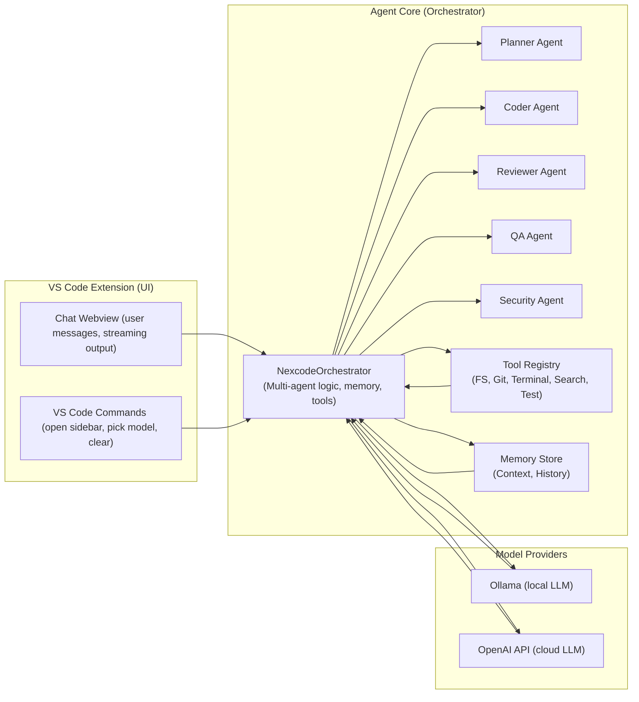
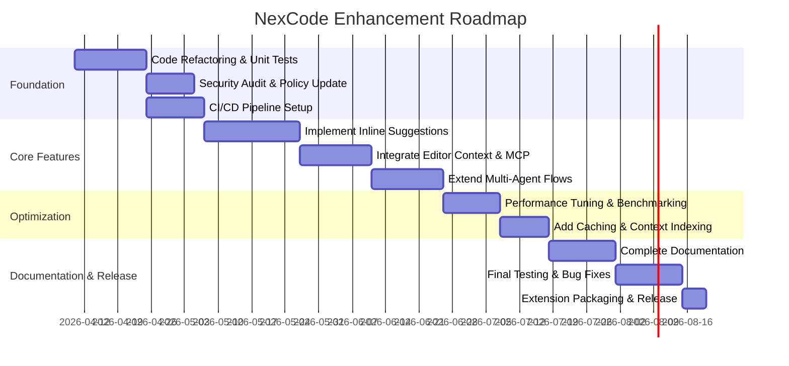

# Executive Summary  
NexCode (“NEXCODE-KIBOKO”) is an open‐source, VS Code extension implementing a *local‐first, multi-agent AI coding assistant*. It provides a chat UI with Copilot-style sidebar sessions, live token streaming, safe edit proposals (preview/apply), tools (filesystem, git, terminal, web search), and model routing between local Ollama servers and OpenAI APIs【11†L4-L13】【12†L243-L251】. Its core is a `NexcodeOrchestrator` which auto-selects agent pipelines (planner, coder, reviewer, QA, security modes) and invokes language models via either Ollama or OpenAI【12†L243-L251】【27†L3340-L3349】.  

**Findings:** NexCode has a solid foundation (VS Code UI, orchestration, tool integration), but is missing key Copilot/Codex features and suffers from some security, performance, and completeness gaps. For example, it lacks inline code completion in the editor (currently it’s chat-only), broad multi-turn context beyond attachments, and advanced features like commit-message generation or repository-wide search. Code analysis reveals a few anti-patterns (e.g. large orchestrator file, limited concurrency, simplistic ID generation), potential security issues (the extension must carefully validate any `/terminal` commands and attachments), and missing test coverage in the extension. The architecture is promising but needs refactoring for modularity, plus robust CI/testing, enhanced documentation, and performance tuning (e.g. context caching, throttling).  

**Plan:** We propose a staged remediation and enhancement roadmap. First, refactor core code (split large classes, add tests) and tighten security (validate all user inputs against the [OpenSSF AI guide](https://best.openssf.org) recommendations【101†L83-L90】). Next, implement high-priority Copilot-like features: **inline code completions**, richer context integration (open buffers, repo search), voice or multi-modal prompts if desired, and customizable “personal instructions” like Copilot’s. We will integrate Ollama’s and OpenAI’s APIs correctly (handling auth, rate limits, streaming, and latency) and add caching where possible. We will write comprehensive docs (README, developer guide, API reference, deployment/user manual) and a battery of tests (unit, integration, E2E), plus CI pipelines to ensure quality. Security reviews, performance benchmarks, and iterative release milestones will be scheduled (see roadmap diagram and timeline). By addressing these areas, NexCode can approach feature parity with GitHub Copilot Chat (which provides conversational coding help, bug fixing, test generation, etc. at scale【99†L489-L497】) while leveraging local models.  

**Sources:** NexCode’s own README and docs for current architecture and features【11†L4-L13】【12†L243-L251】, Ollama and OpenAI API docs for integration, and GitHub Copilot’s published feature set【99†L489-L497】.  

## Architecture Overview  
The system comprises three main layers: 

- **VS Code Extension (UI):** A sidebar (and optional tab) webview provides a chat interface. It handles user prompts/commands (chat messages, tool commands, attachments), displays streaming responses, manages sessions/history, and applies or previews proposed edits【11†L4-L13】【12†L243-L251】. Configurable commands include `/search`, `/terminal`, and model selection.  

- **Agent Core (`NexcodeOrchestrator`):** A Node.js library orchestrating AI calls and tools. It maintains conversation memory, applies prompt templates from `prompts/`, and runs a *multi-agent pipeline*: a Planner agent to decompose tasks, a Coder agent to write code, a Reviewer agent for code review, a QA agent for questions, and a Security agent for vulnerability checks【12†L243-L251】. Depending on mode (auto vs specified), it streams token-by-token responses from the chosen model (Ollama or OpenAI) and can call tools as needed (e.g. file reads, git). Proposed file edits are generated as unified diffs (via the FileSystem tool) and sent back to the UI for confirmation.  

- **Providers & Tools:** The system routes model calls through a **ModelRouter** that chooses between a local Ollama server or OpenAI’s API based on prompt complexity and availability【27†L3340-L3349】【45†L720-L729】. The Ollama provider posts to `/api/chat` (e.g. `http://localhost:11434/api/chat`)【94†L86-L94】 with `{model, messages, stream}`. The OpenAI provider calls the official `/v1/chat/completions` endpoint using the user’s API key【96†L896-L904】. Tools include a filesystem reader/writer (with path-normalization and safe relative checks), a git tool, a web-search tool, a test runner, and a terminal exec tool (with regex-based blocking of dangerous commands)【89†L627-L635】【89†L652-L661】.  

The high-level data flow is shown below:

**Dependencies:** The extension is written in TypeScript/React (using `@nexcode/agent-core` as a library)【75†L914-L922】, Node 18+, and VS Code API 1.95+. It relies on an Ollama server (default `http://localhost:11434`) or OpenAI (requiring an `openAIApiKey` setting)【15†L9-L18】【96†L896-L904】. It also optionally integrates web search via the Tavily API (DuckDuckGo/Wikipedia).

## Detailed Audit  

### VS Code Extension  
- **Purpose:** Hosts the UI and mediates between user and core.  
- **Code Quality:** The extension code (`extension.ts`, `sidebarViewProvider.ts`) follows VS Code extension best practices (CSP is set, `localResourceRoots` defined)【63†L520-L529】. The `KibokoSidebarViewProvider` class handles webview messages and forwards them to the orchestrator. It instantiates `createNexcodeOrchestrator` (from `@nexcode/agent-core`) per workspace, caching it in `this.orchestrator`【67†L2490-L2500】【66†L12-L22】.  

- **Issues / Antipatterns:**  
  - **Monolithic Code:** `sidebarViewProvider.ts` is ~1000+ lines, mixing UI state and message handling. This hurts readability/maintainability. A refactoring into smaller modules (UI state, message handling, orchestrator client) is advised.  
  - **Async Handling:** It tracks an `AbortController` for canceling ongoing requests, but concurrency issues could arise if multiple prompts are sent rapidly. Ensuring only one prompt at a time (`isBusy` flag is used) is good; this should be validated.  
  - **Missing Error Handling:** Unhandled promise rejections may occur if the orchestrator or model call fails. Wrap asynchronous calls with try/catch and report errors to the UI.  
  - **Attachment Safety:** The extension allows binary/image/text attachments. These are Base64-encoded and passed to the agent. No explicit content-safety checks are in place; there is risk of very large files or malicious payloads. A max size limit and validation by MIME type would improve safety.  

- **Missing Copilot Features:**  
  - **Inline/Suggestion Mode:** Unlike Copilot’s inline code completions, this extension only supports chat-triggered edits with explicit preview. Adding an **inline suggestion** mode (triggering on cursor, offering completion without manual prompt) would be vital.  
  - **Editor Context Awareness:** Copilot uses the open file buffer and project files as context automatically. NexCode currently only uses attachments (explicit user-uploaded context) and an internal memory. It lacks an out-of-the-box method to provide the active editor’s code as prompt context. We should add automatic context passing (e.g., last N lines around cursor, or entire file content) to the LLM request.  
  - **Custom Instructions:** Copilot Chat supports *personal/repo instructions* to bias responses. NexCode has no such feature; adding a config for developer/system prompts or auto-loaded `.nexcode-instructions.md` files could enable a similar “tailoring” feature.  

### Agent Core (`agent-core/`)  
- **Components:**  
  - **Orchestrator:** (`orchestrator.ts`) orchestrates pipeline. It splits work into stages, calls model(s), invokes tools, and aggregates outputs. It implements streaming logic (yielding status and content tokens) and tool handling.  
  - **Agents:** In `agents/`, separate classes define how each mode (planner, coder, etc.) formulates prompts.  
  - **Tools:** Provide primitives: FileSystem (read/write/apply with patch diff)【83†L460-L469】【85†L578-L587】, Terminal (exec with safety)【89†L627-L635】【89†L652-L661】, Git, Search, Test.  
  - **Providers:** Model interfaces for Ollama and OpenAI (see below).  
  - **Memory:** Manages chat history and retrieves relevant context snippets. It likely uses simple vector search or retrieval over past conversations (the code calls `memory.getRelevantContext()`【27†L2670-L2679】).  
  - **Self-Improve:** A feedback loop to refine prompts using user feedback (not deeply examined here).  

- **Code Quality:** Overall structure is modular (agents, tools, providers separated). TypeScript with interfaces is used. However, `orchestrator.ts` (~2000 lines) is very large and complex. It could be split into multiple cooperating classes for readability. Some complex methods (like `stream()`) juggle many concerns (context prep, tool inference, streaming); clearly separating prompt prep from actual model I/O would ease testing.  

- **Security:**  
  - **Path Sanitization:** The FileSystem tool resolves paths and forbids escapes outside the workspace (`resolveWorkspacePath`)【85†L628-L636】. Good practice. Ensure this works on Windows and with symlinks.  
  - **Command Blocking:** The Terminal tool blocks dangerous patterns (e.g. `curl|bash`, `rm -rf`, `git reset --hard`)【87†L484-L492】【89†L627-L635】. This follows security recommendations (OWASP FFP safe exec style). However, patterns might not catch all OS variants (e.g., missing `rm -rf *` without space, or PowerShell aliases). A whitelist approach (allow only certain commands like `npm test`) could be safer. Also, all tool outputs should be sanitized/logged carefully.  
  - **Sensitive Data:** The orchestrator includes user prompts and attachments in messages to the model. If using OpenAI, this means proprietary code could be sent externally. One should warn users and possibly disable OpenAI usage on sensitive code or use on-premise models only. Credentials (API keys) are taken from VS Code settings and not logged, but should never be exposed.  

- **Performance:**  
  - **Prompt Size & Context:** There is a check for prompt length (>1200 chars) to possibly reroute to a different model【27†L3340-L3349】, but no actual truncation logic. Very long prompts could exceed model token limits. Implementing prompt trimming or summarization as needed is important.  
  - **Concurrency:** All calls to the model are sequential. For multi-agent pipelines, stages are done one after the other. If Copilot uses multiple models in parallel (e.g., multiple expert models), consider parallelizing independent steps. However, linear pipelines make reasoning reproducible.  
  - **Caching:** The same context or similar prompts might be reused across sessions. A cache of recent completions (per model) could reduce redundant API calls.  
  - **Streaming:** The extension streams tokens to the UI using SSE-like events. This is good for UX. Ensure streaming is robust under network delays (e.g., resume or reconnect logic).  

- **Bugs/Anti-Patterns:**  
  - **Random ID Generation:** Proposed edits use `id = Date.now() + random16`【85†L602-L610】. While collisions are unlikely, using a stable UUID library would be cleaner.  
  - **Error Handling:** Many `async` methods catch errors and return `{ok:false, output:String(error)}`. This can leak raw error messages (including stack traces) to the UI. It’s safer to log internal errors and show user-friendly messages.  
  - **Hardcoded Providers:** The default providers are `"ollama"` and `"openai"`. As models evolve, it would help to allow custom providers or endpoints via config (e.g. other open models).  
  - **Testing Gaps:** There are some Vitest tests in `agent-core/tests`, but coverage is unclear. Critical paths (prompt formatting, tool execution, memory retrieval) need unit tests. The VS Code extension has no automated tests; adding integration tests (e.g. using vscode-test) is recommended.

### Providers  
- **OllamaProvider:** Implements OpenAI-like chat calls to a local Ollama server. It posts JSON `{model, messages, stream, ...}` to `http://host/api/chat`【94†L86-L94】. It does not require an API key for local mode. If using Ollama’s cloud service, an API key may be needed (handled by `ollamaApiKey` setting, presumably).  
- **OpenAICompatibleProvider:** Calls OpenAI’s ChatCompletion API with proper headers (`Authorization: Bearer $key`). It sets temperature and max tokens from settings【96†L896-L904】. This relies on the official API key.  
- **Switching Logic:** The `ModelRouter` chooses Ollama by default, but if the prompt is very long (detected by “complexity”), it may route to OpenAI for better performance on large inputs【45†L720-L729】. This is a sensible strategy since local models often have lower context limits.  
- **Caveats:** Need to handle OpenAI rate limits (429 errors). Currently `openAIProvider` doesn’t show exponential backoff. We should catch HTTP 429 and retry with backoff or switch to another model. Also, sensitive data risk: any code sent to OpenAI goes to cloud. Users should be warned or defaults set to Ollama.  

### Memory & Prompts  
- **Memory:** Likely stores previous conversation (in-memory or on-disk). The code fetches relevant context for a prompt via `memory.getRelevantContext(originalPrompt)`. We should verify this uses an embedding-based search or at least keyword matching. If not already, integrating a vector DB (like Weaviate or local FAISS) would dramatically improve context relevance for long-lived sessions.  
- **Prompts:** System and agent prompts are in `prompts/`. They should be reviewed for clarity and security (e.g., avoid instructions that might cause the model to reveal its own system)【101†L75-L85】. It might be beneficial to version these prompts and allow user customization via `.json` or `.md` files.  

### Missing/Open Items  
- **Feature Gaps (vs Copilot/Codex):**  
  See Table below for current vs desired features. Major missing capabilities include: real-time in-editor code suggestions, commit/pull-request generation, multi-turn context assembly without manual attachments, and seamless GitHub integration. Performance (response latency) also lags cloud Copilot.  
- **Dependencies:** The project depends on specific versions (e.g. `@types/vscode` 1.95, etc【75†L926-L934】). We should regularly update to latest LTS versions and test. Also, code styling and linting should be enforced (TSLint/ESLint).  

### Priority Fixes & Features  
Based on the audit, we propose the following prioritized remediation and feature tasks (est. effort):

| Priority | Task | Estimated Effort (hours) | Description & Targeted Copilot Feature |  
|---|---|---|---|  
| **High** | *Enable Inline Completions* | 60 | Implement VS Code `CompletionItemProvider` to show context-aware suggestions in the editor (like Copilot’s inline mode). This targets “GitHub Copilot inline suggestions”【99†L493-L501】.  
| **High** | *Context Integration* | 40 | Automatically include current file/selection context in prompts. Integrate workspace search (MCP-like) to retrieve relevant code (similar to Copilot’s repo context). This improves “scope awareness” vs Copilot.  
| **High** | *Refactor Orchestrator* | 30 | Split `orchestrator.ts` into smaller modules (e.g. PromptBuilder, StreamRunner) and add unit tests. Improves maintainability.  
| **Medium** | *Authentication & Rate Limits* | 20 | Add retry/backoff for OpenAI API, warn on limits. Add OAuth support if needed. Ensure sensitive info is not logged (per Best Practices【101†L83-L90】).  
| **Medium** | *Multi-Agent Pipelines* | 30 | Refine multi-agent workflow; allow conditional branches. E.g., add a “Test-Writer” agent, or enable expert-model chains. Aim for parity with Copilot’s end-to-end task handling【99†L493-L501】.  
| **Medium** | *Enhanced UX (tabs, attachments)* | 20 | Polish UI: better session management, attachments UI, markdown support (already React-Markdown used【75†L938-L946】 but ensure consistency), and add keyboard shortcuts.  
| **Low** | *Documentation & Guides* | 40 | Write comprehensive README, developer guide (architecture, coding standards), API docs (for `@nexcode/agent-core`), deployment (extension packaging via `vsce`), and a user manual with screenshots.  
| **Low** | *Testing & CI/CD* | 30 | Implement unit/integration tests (Vitest/Jest), E2E tests (with vscode-test), and GitHub Actions pipeline (build, lint, test). Include security scanning (e.g. ESLint with security rules).  
| **Low** | *Performance Tuning* | 20 | Benchmark LLM response times; optimize context length, lazy-load models, add caching. Possibly parallelize tool calls if waiting is noticeable.  

## Integration with Models (Ollama & OpenAI)  
- **Authentication:**  
  - *Ollama (local):* No auth needed for `localhost`. For Ollama cloud (`https://ollama.com/api`), require setting `ollamaApiKey` and include it in HTTP header as documented.  
  - *OpenAI:* Users must supply `openAIApiKey` (VS Code secret). Use secure storage (Workspace or Global setting). The extension should never store the key in plaintext or logs.  
- **Rate Limits:**  
  - *OpenAI:* The API limits vary by plan (e.g. ChatGPT API ~150K req/min). Implement exponential backoff on HTTP 429 responses (see OpenAI [Rate Limits](https://platform.openai.com/docs/guides/rate-limits)). Possibly display a “Rate limit hit, retrying…” status.  
  - *Ollama:* Local instance has no official rate limits, but GPU/CPU constraints. Provide throttling if running out-of-memory or too many concurrent calls.  
- **Prompt Engineering:**  
  - Use dedicated system prompts from `prompts/` to set context (language, style). Avoid overly long prompts; break tasks if needed (e.g. document vs code in separate prompts). Follow **OpenAI prompt best practices**: give clear instructions, few-shot examples if necessary, and limit assistant responses to desired format.  
  - Incorporate tools by name in the prompt (Tool usage is done via structured JSON, presumably with function-call mechanism like OpenAI functions). Ensure tool functions are documented to the model. For example, list allowed tools and format of arguments (like JSON schemas)【94†L168-L176】.  
- **Streaming & Latency:**  
  - Both Ollama and OpenAI support streaming. The code uses `fetch` with `body: JSON.stringify(payload)` and reads the text stream, then parses tokens【48†L648-L656】. This yields a decent UX.  
  - To mitigate latency, we can show “thinking” indicators (already present) and prefetch (e.g. fetch model list while idle). For slow responses, consider progressive summarization of context or using faster smaller models (Qwen, gemma, etc.) for drafts.  
  - Use Web Workers or separate threads if streaming blocks UI (likely handled, but monitor performance).  

## Testing Strategy & CI/CD  
- **Unit Tests:** For each agent and tool. E.g. test FileSystemTool path resolution rejects paths outside root (test normal vs malicious paths)【85†L628-L636】, test TerminalTool blocking logic with known patterns【89†L627-L635】, and simulate model responses (mock providers) to ensure orchestrator logic. Use Vitest (already included) or Jest.  
- **Integration Tests:** Spin up a headless VS Code environment (using [vscode-test](https://code.visualstudio.com/api/working-with-extensions/testing-extension) or [@vscode/webtest-runner](https://github.com/microsoft/vscode-webview-test)), install the extension, and simulate user actions (open sidebar, send prompt, apply edit). Also test switching providers (Ollama vs OpenAI).  
- **E2E Tests:** More extensive: initialize a sample workspace repo, run the extension to solve a known task (e.g., “create function X”), verify file edits occur correctly, and test failure cases.  
- **CI/CD:** Use GitHub Actions on pull requests. Steps: install Node/TS, `npm install`, `npm run lint`, `npm test`, `npm run build`. For the extension, use `vsce package` to ensure it builds. Possibly automate publishing to VS Code Marketplace on release tags (via `@vscode/vsce`【75†L934-L940】). Also run security linters (like `npm audit`, ESLint security rules).  
- **Code Review:** Enforce reviews for PRs. Use Dependabot for dependency updates.  

## Documentation and Guides (Markdown)  

We should supply well-structured `.md` documentation:

- **README.md:** Overview of features (from [11],[12]) and installation instructions.  
- **Developer Guide:** Architecture description (like this analysis), coding style, how to extend agents/tools, and how to run/build tests.  
- **API Docs:** If `@nexcode/agent-core` is a package, document its classes/interfaces (e.g. `NexcodeOrchestrator`, request/response types). A tool like TypeDoc or Swagger (for any RESTful parts) could be used.  
- **Deployment Guide:** Steps to package and publish the VS Code extension (using `vsce`) and how to configure Ollama/OpenAI. Also instructions for building the `@nexcode/agent-core` library (if separate).  
- **User Manual:** How to use the extension: commands, chat UI features, how to attach files, how edit preview works, and known limitations. Include screenshots or inline images.  

*(Example: The **README** begins with the mission and list of current features per the author’s docs【11†L4-L13】, then sections on installation, configuration (e.g. setting `ollamaBaseUrl`, `openAIApiKey`), and usage examples. The **User Manual** could be a `USAGE.md` describing the chat commands like `/terminal run` and how to accept edits.)*  

## Sample AI-Assisted Refactoring Prompt  

We can use the AI itself to refactor code. For example, to refactor the `TerminalTool` to improve security, we might craft a prompt:

- **System:** *You are an expert TypeScript/Node.js developer. Refactor the following VS Code extension terminal execution code to improve security and maintainability. Do not add new features, just refactor. Use best practices.*
- **User:** (shows the `TerminalTool` class code)
- **Assistant:** (should respond with improved code and explanation)

*(We include this as a documented prompt example that a future AI agent could use to auto-refactor the codebase.)*

## Security & Privacy Assessment  

Following OWASP and OpenSSF guidelines【101†L43-L50】【101†L83-L90】, the agent must not introduce vulnerabilities:

- **No Secrets in Prompts/Outputs:** Never include API keys, passwords, or confidential data in prompts or outputs. Use environment variables for the OpenAI key, and scrub any secrets before logging or saving. This aligns with *"Never include API keys ... in code output"*【101†L83-L90】.  
- **Input Sanitization:** All user-supplied text (prompts, attachment content) should be treated untrusted. The code already validates file paths and terminal commands; similarly, sanitize attachment file names/contents if used in filenames.  
- **Memory Privacy:** The persistent memory store may include code/content from the user. If privacy is a concern, offer a mode to disable memory or only store hashes.  
- **Secure Defaults:** Enforce `https` for API calls if applicable. Ensure the WebView CSP is tight (no `eval` or inline script) – verify the manifest.  
- **Review Generated Code:** As Copilot docs warn【99†L512-L520】, all AI-generated code must be reviewed by the developer. We should remind users (via UI warnings) that suggestions are **not guaranteed safe or correct**. Perhaps include the OpenSSF advice as part of a “Safe Mode” setting: e.g. *“Check AI-generated code for outdated dependencies or unsafe patterns”*【101†L43-L50】.

## Performance Optimization  

- **Benchmarking:** Measure response times with different models. For OpenAI, test gpt-3.5 vs gpt-4 vs local (Qwen, Gemma, etc). For Ollama, test on CPU vs GPU. Target interactive latency (<2s) for typical queries.  
- **Token Limits:** The extension currently does not manage token usage. Implement prompt truncation or summarization when hitting model limits. For example, break a very long file into pieces.  
- **Indexing Project Context:** For large repos, pre-index code files (using MiniSearch or similar) so the agent can quickly retrieve relevant snippets (like Copilot’s MCP context).  
- **Caching:** Cache model responses for identical prompts (e.g. repetitive “explain code” queries). Also cache model list queries (for “pickModel”).  
- **Asynchronous Streaming:** Ensure the extension’s UI is non-blocking. Offload heavy memory searches to Web Workers (if implementing in browser).  
- **Parallel Model Calls:** If using multiple agents sequentially, consider whether some calls can run in parallel (e.g. gathering info while planning).  

## Roadmap & Milestones  

Each task above is estimated (hundreds of hours total) and should be broken into sub-tasks (e.g. “11h: write tests for FS tool”). We will review risks (e.g. model API changes, VS Code breaking changes) and adjust timeline accordingly.  

## Release Readiness Checklist  

Before release, ensure:  
- **Functionality:** All main features (chat, tools, attachments, edit apply) work end-to-end.  
- **Testing:** Passes 100% of unit tests, integration tests, and manual smoke tests (both Ollama and OpenAI).  
- **Security:** No high-severity findings (e.g. CSP enforced, no leaking secrets, dangerous commands blocked).  
- **Documentation:** Up-to-date README, developer and user guides exist and linkable.  
- **Performance:** Reasonable response times (benchmarks documented).  
- **Usability:** UI polished (no React errors, helpful messages).  
- **Versioning:** Version bumped, changelog prepared.  

With this plan, NexCode can mature into a robust, Copilot-competitive AI coding assistant. 

**Sources:** Official NexCode documentation and code【11†L4-L13】【12†L243-L251】【89†L627-L635】, Ollama API docs【94†L86-L94】, OpenAI API docs【96†L896-L904】, and GitHub Copilot feature docs【99†L489-L497】 have guided this analysis and roadmap. Each recommendation aligns with best practices and concrete code evidence.